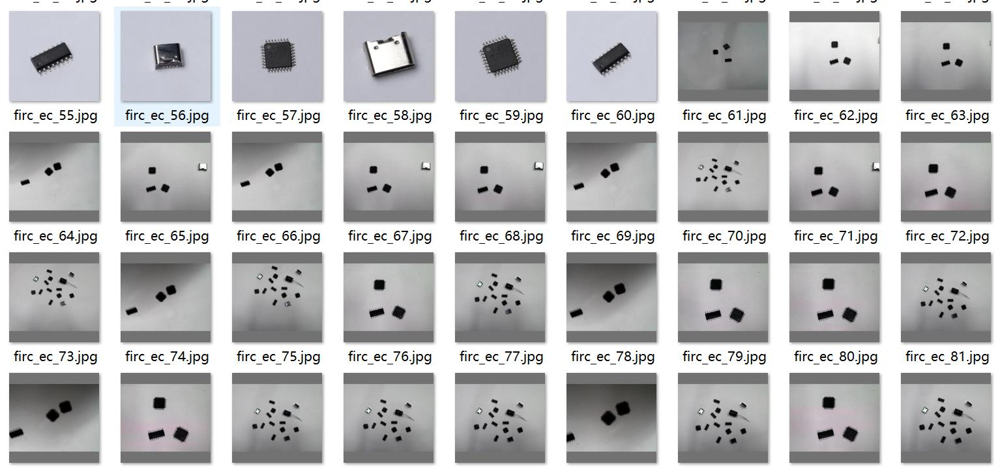
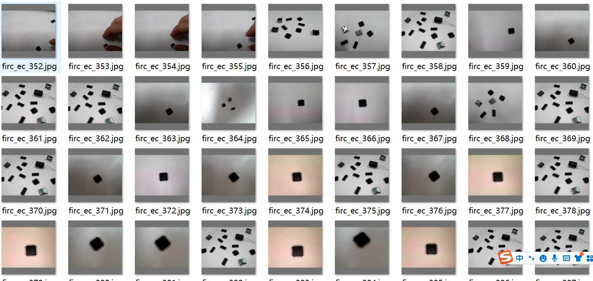
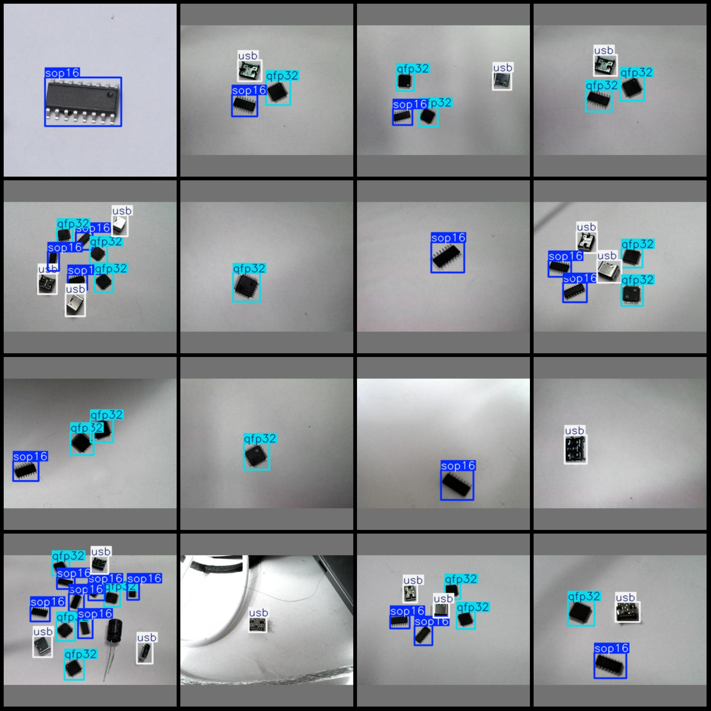
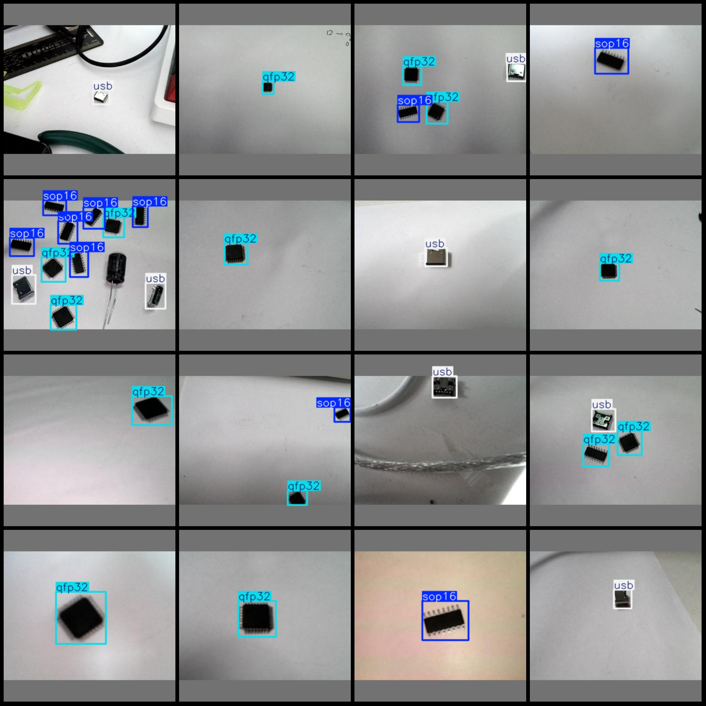

# Electronic Chip Type Identification and Detection Dataset (VOC+YOLO format) - 1226 Images in 3 Categories

Dataset Format: Pascal VOC format + YOLO format (txt file without split path, only containing jpg images along with corresponding VOC format xml files and yolo format txt files).
Number of Images (jpg file count): 1266
Number of Annotations (xml file count): 1266
Number of Annotations (txt file count): 1266
Number of Annotation Categories: 3
Annotation Category Names (note that the order of categories in the yolo format does not match this, but is based on the classes.txt in the labels folder): ["qfp32", "sop16", "usb"]
Number of Boxes per Category:
- qfp32 (32-pin square flat package) = 1287 boxes
- sop16 (16-pin small outline package) = 1371 boxes
- USB (USB interface) = 1010 boxes
Total Boxes: 3668
Image Resolution: 320x320
Annotation Tool Used: labelImg
Annotation Rules: Drawing a box around the category
Important Notice: No warranty given regarding the accuracy of the trained models or weight files.
Image Preview:
Annotation Example:

## Images

Here is a pay link on Stripe ( https://buy.stripe.com/3cs8yP7sY87d0vu9AB ). Please contact me lonlonago@foxmail.com after funding $89, and I will send you a complete data files , thank you!

